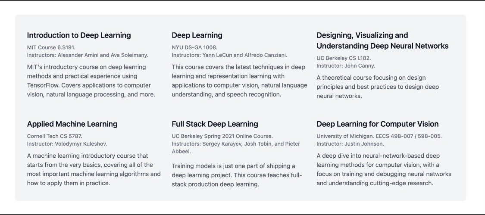

# ai-links

This is the list of links on Deep Learning that I have collected over time.

## Resources

1. [An introduction to Generative Adversarial Networks (with code in TensorFlow) - AYLIEN News API](https://aylien.com/blog/introduction-generative-adversarial-networks-code-tensorflow)
2. [Generative Models](https://openai.com/blog/generative-models/)
3. [Adverarial Nets](https://cs.stanford.edu/people/karpathy/gan/)
4. [Generative Adversarial Nets in TensorFlow - Agustinus Kristiadi](https://agustinus.kristia.de/techblog/2016/09/17/gan-tensorflow/)
5. [A (Very) Gentle Introduction to Generative Adversarial Networks (a.k…](https://www.slideshare.net/ThomasDaSilvaPaula/a-very-gentle-introduction-to-generative-adversarial-networks-aka-gans-71614428)
6. [Eric Jang: Generative Adversarial Nets in TensorFlow (Part I)](http://blog.evjang.com/2016/06/generative-adversarial-nets-in.html)
7. [Generative Adversarial Networks Explained with a Classic Spongebob Squarepants Episode | by Arthur Juliani | Medium](https://awjuliani.medium.com/generative-adversarial-networks-explained-with-a-classic-spongebob-squarepants-episode-54deab2fce39)
8. [YouTube - Active One-shot Learning](https://www.youtube.com/watch?v=CzQSQ_0Z-QU)
9. [1605.06065 One-shot Learning with Memory-Augmented Neural Networks](https://arxiv.org/abs/1605.06065)
10. [Differential neural computer from DeepMind and more advances in backward propagation](https://futuristech.info/posts/differential-neural-computer-from-deepmind-and-more-advances-in-backward-propagation)
11. [Google’s DeepMind AI Now Capable of ‘Deep Neural Reasoning’ – The New Stack](https://thenewstack.io/googles-deepmind-ai-now-capable-deep-neural-reasoning/)
12. [Tutorial - What is a variational autoencoder? – Jaan Altosaar](https://jaan.io/what-is-variational-autoencoder-vae-tutorial/)
13. [Variational Autoencoders Explained](https://kvfrans.com/variational-autoencoders-explained/)
14. [Under the Hood of the Variational Autoencoder (in Prose and Code)](https://blog.fastforwardlabs.com/2016/08/22/under-the-hood-of-the-variational-autoencoder-in-prose-and-code.html)
15. [Variational Autoencoder in TensorFlow](https://jmetzen.github.io/2015-11-27/vae.html)
16. [Eric Jang: Tutorial: Categorical Variational Autoencoders using Gumbel-Softmax](https://blog.evjang.com/2016/11/tutorial-categorical-variational.html)
17. [Implementing Dynamic memory networks · YerevaNN](https://yerevann.github.io/2016/02/05/implementing-dynamic-memory-networks/)
18. [Variational Autoencoder (VAE) in Pytorch - Agustinus Kristiadi](https://agustinus.kristia.de/techblog/2017/01/24/vae-pytorch/)
19. [PyTorch quick start: Classifying an image — Outcome Blog  documentation](http://blog.outcome.io/pytorch-quick-start-classifying-an-image/)
20. [An end to end implementation of a Machine Learning pipelinet](https://spandan-madan.github.io/DeepLearningProject/)
21. [1602.05568 Multi-layer Representation Learning for Medical Concepts](https://arxiv.org/abs/1602.05568)
22. [1605.03481 Tweet2Vec: Character-Based Distributed Representations for Social Media](https://arxiv.org/abs/1605.03481)
23. [1603.07012 Semi-supervised Word Sense Disambiguation with Neural Models](https://arxiv.org/abs/1603.07012)
24. [1708.00524 Using millions of emoji occurrences to learn any-domain representations for detecting sentiment, emotion and sarcasm](https://arxiv.org/abs/1708.00524)
25. [1704.08847 Parseval Networks: Improving Robustness to Adversarial Examples](https://arxiv.org/abs/1704.08847)
26. [SoundNet: Learning Sound Representations from Unlabeled Video - MIT](http://soundnet.csail.mit.edu/)
27. [DeepMoji](http://deepmoji.mit.edu/)
28. [Introduction to Machine Learning Interviews Book · MLIB](https://huyenchip.com/ml-interviews-book/)
29. [Fastcore - Fast.ai](https://fastcore.fast.ai)
30. [Explained AI](https://explained.ai)
31. [Schedule «  AGI-21: SF Bay Area and Virtual, Oct. 15-18, 2021](http://agi-conf.org/2021/schedule/?mc_cid=3042e76e83&mc_eid=ecc743345f)
32. [Machine Learning Crash Course  |  Google Developers](https://developers.google.com/machine-learning/crash-course)
33. [Stanford CRFM](https://crfm.stanford.edu/workshop.html)
34. [HuBERT: How to Apply BERT to Speech, Visually Explained | Jonathan Bgn](https://jonathanbgn.com/2021/10/30/hubert-visually-explained.html)
35. [Python Numpy Tutorial (with Jupyter and Colab)](https://cs231n.github.io/python-numpy-tutorial/)
36. [Stanford DAWN · DAWN](https://dawn.cs.stanford.edu)
37. [2022 AGI Safety Fundamentals alignment curriculum](https://docs.google.com/document/d/1mTm_sT2YQx3mRXQD6J2xD2QJG1c3kHyvX8kQc_IQ0ns/mobilebasic)
38. [Socratic Models: Composing Zero-Shot Multimodal Reasoning with Language](https://socraticmodels.github.io/)
39. [Deep Learning Links](https://deep-learning-links.carrd.co/)
40. [MLExpert | MLExpert - land your dream Machine Learning job](https://mlexpert.io/)
41. [Cloudera Fast Forward Blog](https://blog.fastforwardlabs.com/)
42. [Design Patterns in Machine Learning Code and Systems](https://eugeneyan.com/writing/design-patterns/)

## Deep Learning Repositories

1. [GitHub - teddykoker/tinyloader](https://github.com/teddykoker/tinyloader)
2. [GitHub - karpathy/micrograd: A tiny scalar-valued autograd engine and a neural net library on top of it with PyTorch-like API](https://github.com/karpathy/micrograd)
3. [GitHub - Renovamen/flint: A toy deep learning framework implemented in pure Numpy from scratch. Aka homemade PyTorch lol.](https://github.com/Renovamen/flint)
4. [GitHub - Renovamen/Text-Classification: PyTorch implementation of some text classification models (HAN, fastText, BiLSTM-Attention, TextCNN, Transformer) | 文本分类](https://github.com/Renovamen/Text-Classification)
5. [GitHub - Renovamen/metallic: A clean, lightweight and modularized PyTorch meta-learning library.](https://github.com/Renovamen/metallic)
6. [GitHub - graph4ai/graph4nlp: Graph4nlp is the library for the easy use of Graph Neural Networks for NLP](https://github.com/graph4ai/graph4nlp)
7. [GitHub - maziarraissi/Applied-Deep-Learning: Applied Deep Learning](https://github.com/maziarraissi/Applied-Deep-Learning)
8. [GitHub - dair-ai/ML-YouTube-Courses: A repository to index and organize the latest machine learning courses found on YouTube.](https://github.com/dair-ai/ML-YouTube-Courses)
9. [GitHub - NVIDIA/DeepLearningExamples: Deep Learning Examples](https://github.com/NVIDIA/DeepLearningExamples)
10. [GitHub - rossant/awesome-math: A curated list of awesome mathematics resources](https://github.com/rossant/awesome-math)
11. [GitHub - eugeneyan/applied-ml: 📚 Papers & tech blogs by companies sharing their work on data science & machine learning in production.](https://github.com/eugeneyan/applied-ml)
12. [GitHub - tmabraham/awesome-fastai: A curated list of awesome fastai projects/blog posts/tutorials/etc.](https://github.com/tmabraham/awesome-fastai)
13. [GitHub - booknlp/booknlp: BookNLP, a natural language processing pipeline for books](https://github.com/booknlp/booknlp)
14. [GitHub - amitness/learning: Becoming better at data science every day](https://github.com/amitness/learning)
15. [GitHub - dair-ai/Transformers-Recipe: A quick recipe to learn all about Transformers](https://github.com/dair-ai/Transformers-Recipe)
16. [GitHub - minitorch/minitorch: The full minitorch student suite.](https://github.com/minitorch/minitorch)
17. [GitHub - rmcelreath/stat_rethinking_2022: Statistical Rethinking course winter 2022](https://github.com/rmcelreath/stat_rethinking_2022)
18. [GitHub - qdrant/awesome-metric-learning: 😎 A curated list of awesome practical Metric Learning and its applications](https://github.com/qdrant/awesome-metric-learning)
19. [GitHub - kurtispykes/Natural-Language-Processing: Curated articles and code on NLP](https://github.com/kurtispykes/Natural-Language-Processing)
20. [GitHub - kurtispykes/Deep-Learning: Curated articles and code on deep learning topics](https://github.com/kurtispykes/Deep-Learning)
21. [GitHub - lucidrains/DALLE2-pytorch: Implementation of DALL-E 2, OpenAI’s updated text-to-image synthesis neural network,  in Pytorch](https://github.com/lucidrains/DALLE2-pytorch)
22. [GitHub - ivan-bilan/The-NLP-Pandect: A comprehensive reference for all topics related to Natural Language Processing](https://github.com/ivan-bilan/The-NLP-Pandect)
23. [GitHub - ritchieng/the-incredible-pytorch: The Incredible PyTorch: a curated list of tutorials, papers, projects, communities and more relating to PyTorch.](https://github.com/ritchieng/the-incredible-pytorch)
24. [GitHub - anantzoid/VQA-Keras-Visual-Question-Answering: Visual Question Answering task written in Keras that answers questions about images](https://github.com/anantzoid/VQA-Keras-Visual-Question-Answering)
25. [GitHub - carpedm20/MemN2N-tensorflow: “End-To-End Memory Networks” in Tensorflow](https://github.com/carpedm20/MemN2N-tensorflow)
26. [GitHub - ryankiros/skip-thoughts: Sent2Vec encoder and training code from the paper “Skip-Thought Vectors”](https://github.com/ryankiros/skip-thoughts)
27. [GitHub - btcsuite/btcd: An alternative full node bitcoin implementation written in Go (golang)](https://github.com/btcsuite/btcd)
28. [GitHub - speechbrain/speechbrain: A PyTorch-based Speech Toolkit](https://github.com/speechbrain/speechbrain)
29. [GitHub - The-AI-Summer/learn-deep-learning: AI Summer’s complete catalog of articles](https://github.com/The-AI-Summer/learn-deep-learning)
30. [GitHub - eugeneyan/applied-ml: 📚 Papers & tech blogs by companies sharing their work on data science & machine learning in production.](https://github.com/eugeneyan/applied-ml)
31. [GitHub - dennybritz/deeplearning-papernotes: Summaries and notes on Deep Learning research papers](https://github.com/dennybritz/deeplearning-papernotes)
32. [GitHub - The-AI-Summer/learn-deep-learning: AI Summer’s complete catalog of articles](https://github.com/The-AI-Summer/learn-deep-learning)
33. [GitHub - Synthaze/EpyNN: Educational python for Neural Networks.](https://github.com/synthaze/epynn)
34. [GitHub - Nyandwi/machine_learning_complete: A comprehensive repository containing 30+ notebooks on learning machine learning!](https://github.com/Nyandwi/machine_learning_complete)
35. [GitHub - kenjihiranabe/The-Art-of-Linear-Algebra: Graphic notes on Gilbert Strang’s “Linear Algebra for Everyone”](https://github.com/kenjihiranabe/The-Art-of-Linear-Algebra)
36. [GitHub - dair-ai/ML-Notebooks: A series of code examples for all sorts of machine learning tasks and applications.](https://github.com/dair-ai/ML-Notebooks)
37. [GitHub - khuyentran1401/Data-science: Collection of useful data science topics along with code and articles](https://github.com/khuyentran1401/Data-science)
38. [GitHub - Ying1123/awesome-neural-symbolic: A list of awesome neural symbolic papers.](https://github.com/Ying1123/awesome-neural-symbolic)
39. [GitHub - CYHSM/awesome-neuro-ai-papers: Papers from the intersection of deep learning and neuroscience](https://github.com/CYHSM/awesome-neuro-ai-papers)
40. [GitHub - hollance/neural-engine: Everything we actually know about the Apple Neural Engine (ANE)](https://github.com/hollance/neural-engine)

## Interpretability

1. [GitHub - slundberg/shap: A game theoretic approach to explain the output of any machine learning model.](https://github.com/slundberg/shap)
2. [GitHub - cdpierse/transformers-interpret: Model explainability that works seamlessly with 🤗 transformers. Explain your transformers model in just 2 lines of code.](https://github.com/cdpierse/transformers-interpret)
3. [GitHub - g8a9/ferret: A python package for benchmarking interpretability techniques.](https://github.com/g8a9/ferret)

## Publications and Annotations

1. [A Mathematical Framework for Transformer Circuits](https://transformer-circuits.pub/2021/framework/index.html)
2. [labml.ai Annotated PyTorch Paper Implementations](https://nn.labml.ai)
3. [explained.ai](https://explained.ai)
4. [GitHub - labmlai/annotated_deep_learning_paper_implementations: 🧑‍🏫 50! Implementations/tutorials of deep learning papers with side-by-side notes 📝; including transformers (original, xl, switch, feedback, vit, …), optimizers (Adam, adabelief, …), gans(cyclegan, stylegan2, …), 🎮 reinforcement learning (ppo, dqn), capsnet, distillation, … 🧠](https://github.com/labmlai/annotated_deep_learning_paper_implementations)
5. [Transformers from Scratch](https://e2eml.school/transformers.html)
6. [Pandas Tutor - visualize Python pandas code](https://pandastutor.com)
7. [The Illustrated Retrieval Transformer – Jay Alammar – Visualizing machine learning one concept at a time.](http://jalammar.github.io/illustrated-retrieval-transformer/)
8. [You don’t know JAX](https://colinraffel.com/blog/you-don-t-know-jax.html)
9. [The Annotated Transformer](http://nlp.seas.harvard.edu/annotated-transformer/)
10. [Differentiable Programming from Scratch – Max Slater – Computer Graphics, Programming, and Math](https://thenumb.at/Autodiff/)
11. [Logistic Regression](https://mlu-explain.github.io/logistic-regression/)

## Courses

1. [Natural Language Processing (NLP) for Semantic Search | Pinecone](https://www.pinecone.io/learn/nlp/)
2. [Syllabus for Mathematical Background for Machine Learning](https://canvas.cmu.edu/courses/603/assignments/syllabus)
3. [Linear Algebra | Mathematics | MIT OpenCourseWare](https://ocw.mit.edu/courses/mathematics/18-06sc-linear-algebra-fall-2011/)
4. [Deep Learning for Natural Language Processing](https://www.cs.ox.ac.uk/teaching/courses/2016-2017/dl/)
5. [Stanford CS 224N | Natural Language Processing with Deep Learning](https://web.stanford.edu/class/cs224n/)
6. [A visual introduction to machine learning](http://www.r2d3.us/visual-intro-to-machine-learning-part-1/)
7. [GitHub - AMAI-GmbH/AI-Expert-Roadmap: Roadmap to becoming an Artificial Intelligence Expert in 2022](https://github.com/AMAI-GmbH/AI-Expert-Roadmap)
8. [Deep Learning for Particle Physicists — Deep Learning for Particle Physicists](https://lewtun.github.io/dl4phys/intro.html)
9. [Neural networks and deep learning](http://neuralnetworksanddeeplearning.com/)
10. [AMMI Geometric Deep Learning Course - Second Edition (2022) - YouTube](https://www.youtube.com/playlist?app=desktop&list=PLn2-dEmQeTfSLXW8yXP4q_Ii58wFdxb3C)
11. [GitHub - microsoft/AI-For-Beginners: 12 Weeks, 24 Lessons, AI for All!](https://github.com/microsoft/AI-For-Beginners)
12. [First Principles of Computer Vision - YouTube](https://www.youtube.com/channel/UCf0WB91t8Ky6AuYcQV0CcLw/playlists?app=desktop)
13. [UNIGE 14x050 – Deep Learning](https://fleuret.org/dlc/#vm)
14. [Deep Learning Systems](https://dlsyscourse.org/)
15. 

## MLOps

1. [GitHub - dair-ai/MLOPs-Primer: A collection of resources to learn about MLOPs.](https://github.com/dair-ai/MLOPs-Primer)

## Industry Related

1. [GitHub - andrewekhalel/MLQuestions: Machine Learning and Computer Vision Engineer - Technical Interview Questions](https://github.com/andrewekhalel/MLQuestions)

## Contribute

To add links to this repository that you think are in any of the given category, please raise a PR or an issue will suffice as well.
